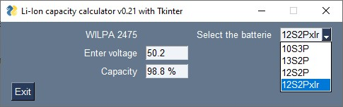

# Li-ion capacity

This program calculates the capacity in percentage from the voltage measured at the terminals
of Lithium-Ion battery pack from the manufacturer Williamson.

The models WILPA2210 (13S2P), WILPA2475 (10S3P) and WILPA2554 (12S2P) use SAFT cells,
model MP176065 with nominal voltage 3.75V, load 4.2V and cutoff 2.5V,
with a life cycle of about 600 loads.
The more recent MP176065 xlr cell, has a slightly lower nominal voltage of 3.65V, load 4.2V and cutoff 2.5V, but with a higher life cycle of about 1800 charges.

## Prequisites for Windows

You must install the following tools:

- Visual Studio Code (<https://code.visualstudio.com/>)
- Git (<https://git-scm.com/downloads>)
- miniconda3 (<https://docs.conda.io/en/latest/miniconda.html>)
- chocolatey (<https://chocolatey.org/install>) and install GNU Make package (<https://community.chocolatey.org/packages/make>)

## Installation based on an YAML environment file

``` bash
conda env create -f environment<OS>.yml -n <new_env_name>
```

example:

``` bash
conda env create -f environment-windows.yml -n li-ion
```

## Installation from scratch

We will use VSC as a development tool with conda and python 3.9

```sh
conda create -n li-ion python=3.9
conda activate li-ion
conda install -c conda-forge appdirs toml PySimpleGUI numpy pyinstaller

```

## Export your environment

Duplicate your environment on other computer or OS, just export it to a YAML file:

```sh
conda env export --no-builds > environment-linux.yml
```

## Update the environment

```sh
conda env update --prefix ./li-ion --file environment-linux.yml --prune
```

## Remove an environment

```sh
conda env remove --name <env>
```

## Main view


